# Bug Reports

## BUG-001 - Password recovery email is not received after a successful recovery request

| Field | Details |
|---|---|
| Related Test Case | TC-031 |
| Severity | Major |
| Priority | High |
| Status | Open |
| Environment | nopCommerce Demo Store |
| Browser | Google Chrome 153.0.8010.48 |
| OS | Windows 11 Pro 25H2 |

### Preconditions
- A registered customer account exists.
- The customer has access to the registered email inbox.

### Steps to Reproduce
1. Open the Password Recovery page.
2. Enter the email address of a registered customer.
3. Submit the password recovery request.
4. Verify that the confirmation message is displayed.
5. Check the registered email inbox, including Spam folder.

### Expected Result
A password recovery email with instructions is received at the registered email address.

### Actual Result
The message "Email with instructions has been sent to you." is displayed, but the password recovery email is not received.

### Notes
The email was not received after multiple checks over several days. Inbox and Spam folders were checked.

The issue blocks TC-032, TC-033, and TC-034.

### Evidence

**Password recovery request is reported as successful:**

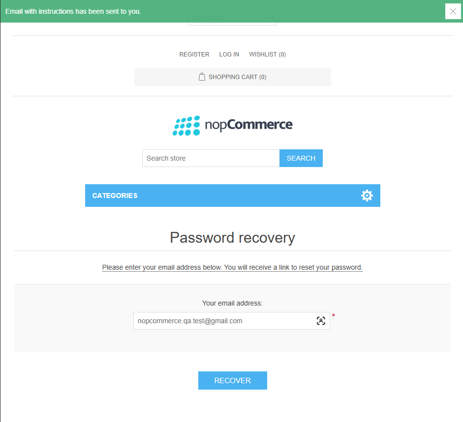

**No password recovery email was received:**

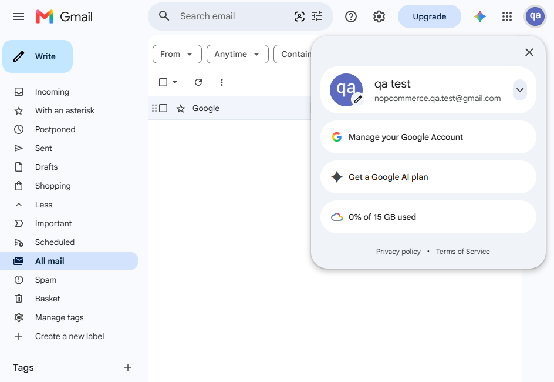

## BUG-002 - State / Province field is required but is not marked as required

| Field | Details |
|---|---|
| Found During | Exploratory Testing |
| Severity | Minor |
| Priority | Medium |
| Status | Open |
| Environment | nopCommerce Demo Store |
| Browser | Google Chrome 153.0.8010.48 |
| OS | Windows 11 Pro 25H2 |

### Preconditions
- The customer is logged in.
- The shopping cart contains at least one shippable product.
- The checkout address step is open.
- A country with configured states/provinces is selected, for example "United States of America".

### Steps to Reproduce
1. Select "New Address".
2. Enter valid data in all required address fields except State / Province.
3. Leave the State / Province field unselected.
4. Click "Continue".

### Expected Result
The State / Province field should be clearly marked as required when it must be selected for the chosen country.

### Actual Result
The State / Province field is not marked as required, but validation prevents the customer from continuing until a State / Province is selected.

### Notes
The behavior is reproducible for countries that have configured states/provinces, such as the United States of America, Australia, Cyprus, and Kuwait.
For countries without configured state/province options, the field displays "Other" and the customer can continue without selecting a value.

### Evidence

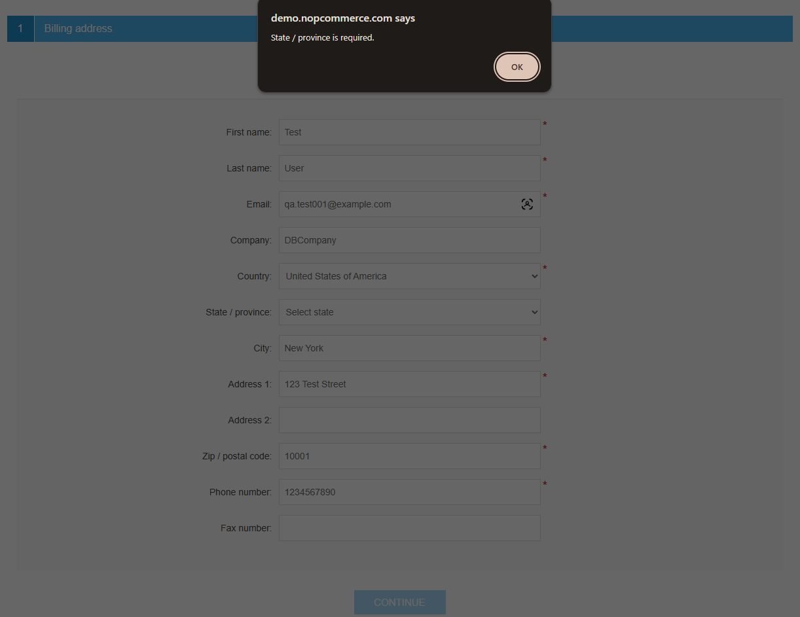

## BUG-003 - Misleading and inconsistent validation messages for Password and Confirm password fields

| Field | Details |
|---|---|
| Found During | Exploratory Testing |
| Severity | Minor |
| Priority | Medium |
| Status | Open |
| Environment | nopCommerce Demo Store |
| Browser | Google Chrome 153.0.8010.48 |
| OS | Windows 11 Pro 25H2 |

### Preconditions
- The Registration page is open.

### Steps to Reproduce

#### Scenario 1
1. Enter valid data in all required registration fields except Password.
2. Leave the Password field empty.
3. Enter `Test1234` in the Confirm password field.
4. Click "REGISTER".

#### Scenario 2
1. Enter valid data in all required registration fields except Confirm password.
2. Enter `Test1234` in the Password field.
3. Leave the Confirm password field empty.
4. Click "REGISTER".

### Expected Result
The validation should clearly identify which password field is empty and provide a consistent message that helps the user correct the input.

### Actual Result
- When the Password field is empty and Confirm password contains `Test1234`, the message "The password and confirmation password do not match." is displayed.
- When the Password field contains `Test1234` and Confirm password is empty, the message "Password is required." is displayed.

### Notes
The validation messages are inconsistent between the Password and Confirm password fields.

The first scenario reports a password mismatch instead of clearly indicating that the Password field is empty. The second scenario reports "Password is required." even though the empty field is Confirm password.

The official nopCommerce documentation describes password requirements but does not document this asymmetric validation behavior.

### Evidence

**Scenario 1 - Password is empty:**

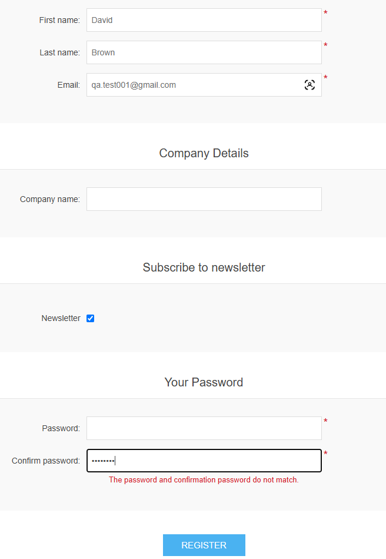

**Scenario 2 - Confirm password is empty:**

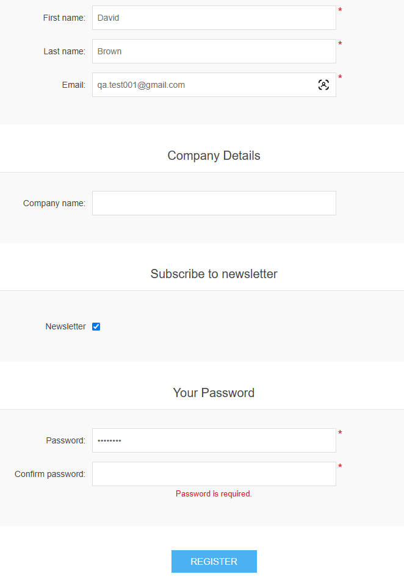

## BUG-004 - Apple iPhone 16 is missing the Apple manufacturer assignment

| Field | Details |
|---|---|
| Found During | ET-003 - Search and Product Discovery |
| Severity | Minor |
| Priority | Medium |
| Status | Open |
| Environment | nopCommerce Demo Store |
| Browser | Google Chrome 153.0.8010.48 |
| OS | Windows 11 Pro 25H2 |

### Preconditions
- The nopCommerce Demo Store is open.
- Apple products are available in the catalog.

### Steps to Reproduce
1. Search for `Apple`.
2. Verify that `Apple iPhone 16 128GB` is displayed in the search results.
3. Open the `Apple iPhone 16 128GB` product details page.
4. Check the product manufacturer information.
5. Open the `Apple` manufacturer page.
6. Check the products displayed for the Apple manufacturer.

### Expected Result
`Apple iPhone 16 128GB` should have `Manufacturer: Apple` assigned and should be displayed on the Apple manufacturer page together with the other Apple products.

### Actual Result
Searching for `Apple` returns:
- Apple MacBook Pro
- Apple iCam
- Apple iPhone 16 128GB

The `Apple iPhone 16 128GB` product details page does not display a manufacturer.

The Apple manufacturer page displays Apple iCam and Apple MacBook Pro, but does not include Apple iPhone 16 128GB.

### Notes
The Apple manufacturer page correctly returns products that have the Apple manufacturer assigned.

The issue appears to be caused by a missing manufacturer assignment for `Apple iPhone 16 128GB` rather than by incorrect manufacturer filtering.

The issue affects product discovery through manufacturer navigation.

### Evidence

**Search for `Apple` returns all three Apple products:**

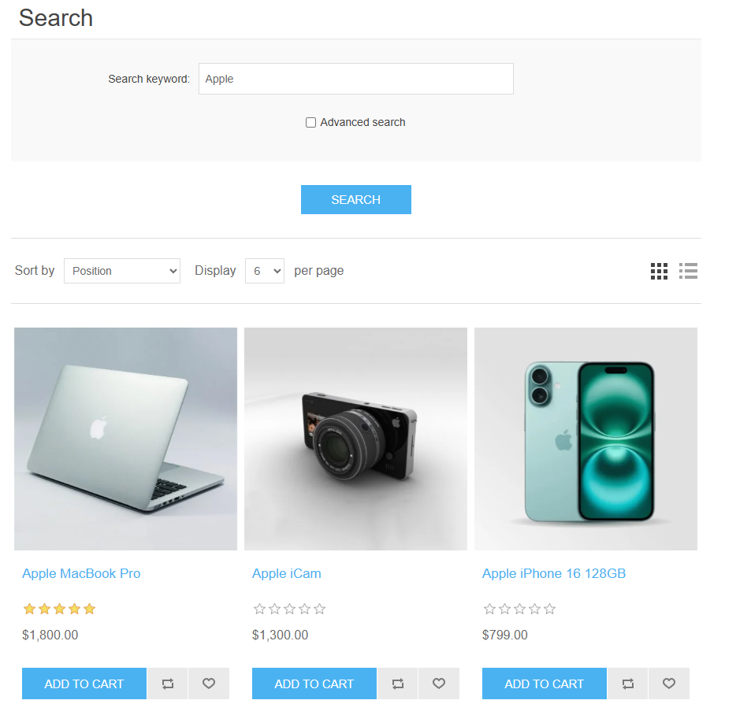

**Apple iPhone 16 product details without manufacturer information:**

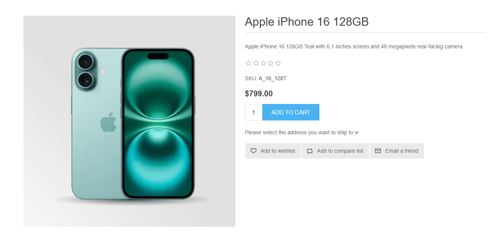

**Apple manufacturer page does not include Apple iPhone 16:**

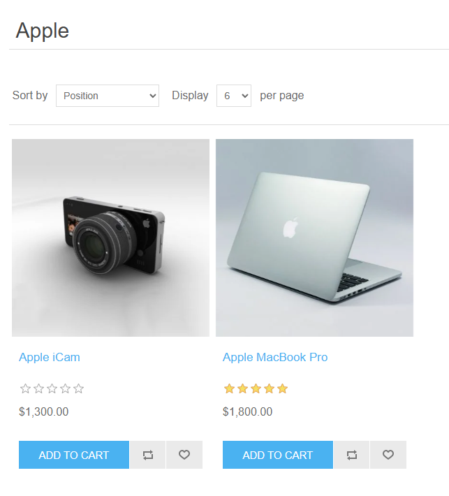

## BUG-005 - Product cannot be found by SKU assigned to a product attribute combination

| Field | Details |
|---|---|
| Found During | ET-003 - Search and Product Discovery |
| Severity | Minor |
| Priority | Medium |
| Status | Open |
| Environment | nopCommerce Demo Store |
| Browser | Google Chrome 153.0.8010.48 |
| OS | Windows 11 Pro 25H2 |

### Preconditions
- The nopCommerce Demo Store is open.
- The `Nikon D5500 DSLR` product is available.
- The product has attribute combinations with separate SKUs:
  - Black - `N5500DS_B`
  - Red - `N5500DS_R`

### Steps to Reproduce
1. Open the Search page.
2. Enter `N5500DS_B` in the search field.
3. Click "SEARCH".
4. Verify the search results.
5. Repeat the search using `N5500DS_R`.
6. As a control check, search for the regular product SKU `AP_MBP_13`.

### Expected Result
Searching by an exact SKU assigned to a product attribute combination should return the corresponding product.

The regular product SKU `AP_MBP_13` should also return its corresponding product.

### Actual Result
Searching for `N5500DS_B` returns no products.

Searching for `N5500DS_R` returns no products.

Searching for the regular product SKU `AP_MBP_13` successfully returns the Apple MacBook Pro.

### Notes
The issue affects SKUs assigned to product attribute combinations.

The base `Nikon D5500 DSLR` product does not have its own SKU, while its Black and Red combinations have separate SKUs.

The behavior was also reproduced using Advanced Search.

Regular product SKU search works correctly, while attribute combination SKUs are not returned.

### Evidence

**Nikon D5500 DSLR attribute combinations with separate SKUs:**

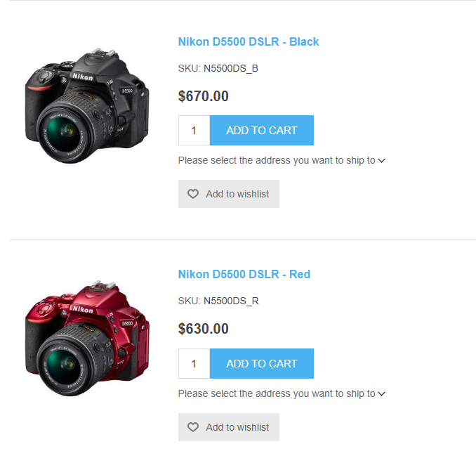

**Search for `N5500DS_B` returns no products:**

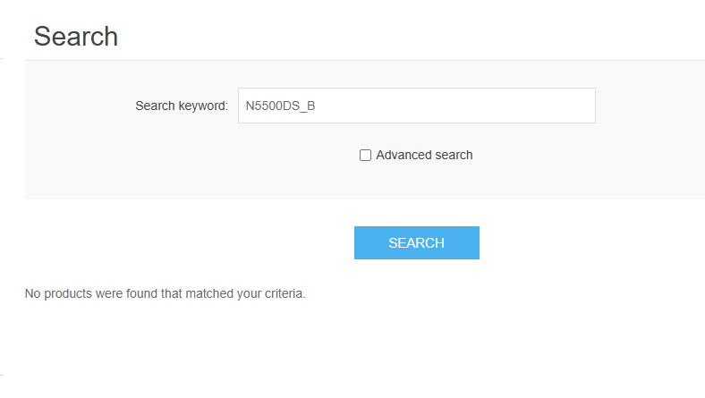

**Search for `N5500DS_R` returns no products:**

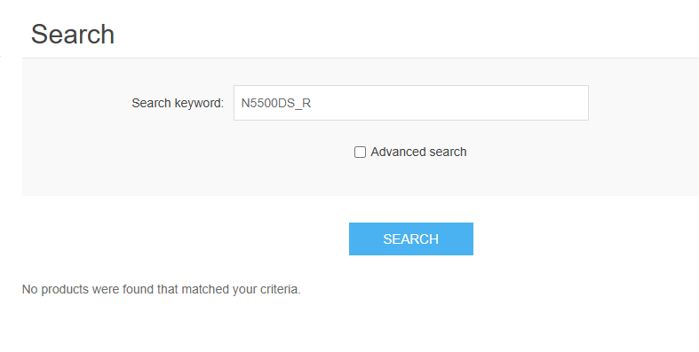

**Control check - regular product SKU `AP_MBP_13` returns the MacBook:**

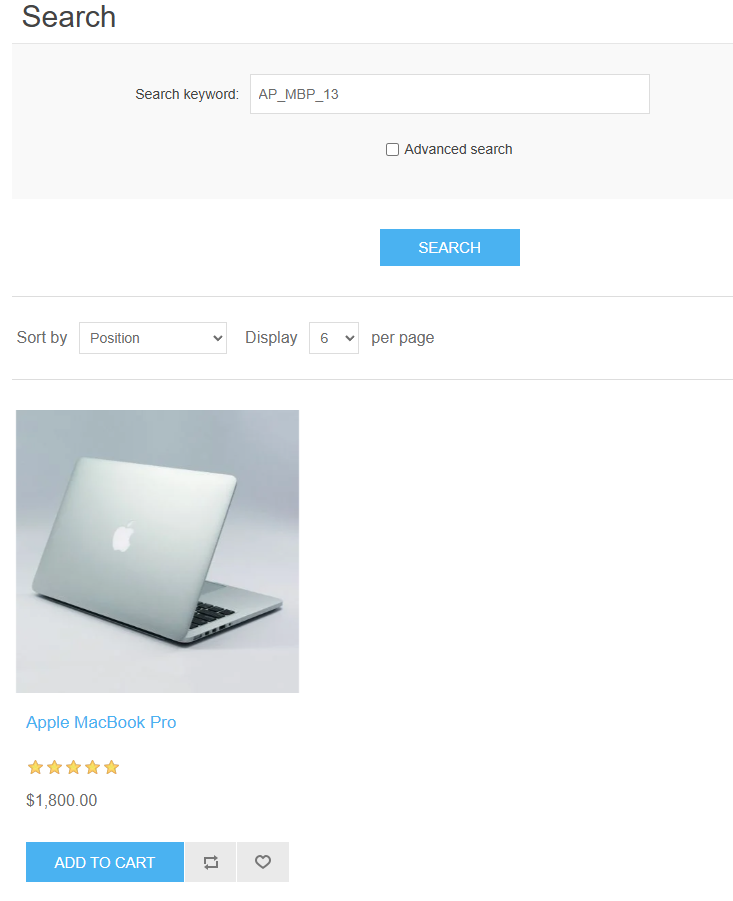
